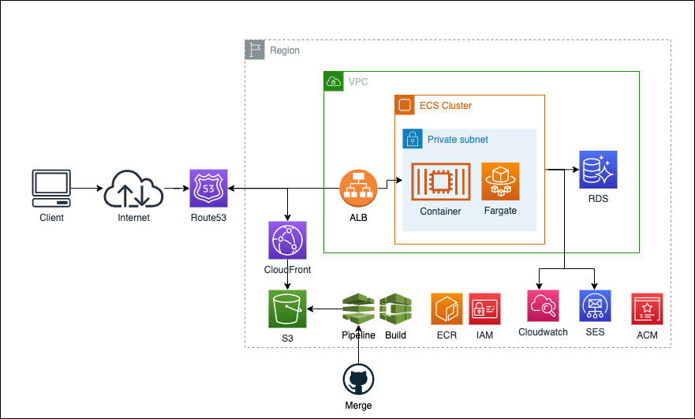

# Terraform Project for Booking System

Managing the booking system's infrastructure through terraform. Uses ECS Fargate to manage a fleet of Node.js applications running Express servers, an ALB to load balance the requests and RDS running PostgreSQL for the main data store. SES is used by the applications for sending emails. S3 is used for static storage of the frontend sites which are built and deployed using a CodePipeline to CloudFront.

## Infrastructure Diagram
Broad overview of the infrastrcuture setup with this terraform project and the AWS services used (note R53 was in the end not used as the client used a different registrar service)



## Requirements
- Terraform 0.12.18

## Setting up

- Recommend using [tfswitch](https://warrensbox.github.io/terraform-switcher/additional.html) tool. Download and run `tfswitch` to select appropriate version.
If you are still using terraform and wish to keep it, just [download](https://www.terraform.io/downloads.html), move and re-name the bin
    ```
    mv ~/Downloads/terraform /usr/local/bin/terraform12
    ```

- Ensure that your `~/.aws/credentials` file has the `aws_access_key_id` and `aws_secret_access_key` defined in the `booking` group and set the environment variables in `.env.example` accordingly. Note that the Terraform Backend configuration requires these credentials but cannot be configured using environment variables. Therefore it's defaulted to `~/.aws/credentials` and `booking`.
- Run `terraform init` to download the state and plugins required for the [configuration](https://learn.hashicorp.com/terraform/getting-started/build#initialization). This is only required for the first time you clone the repository.
- Run `terraform plan` and expect it to succeed without drift in configuration.

## Running the project
- `terraform workspace list` to list all workspaces (environments).
- `terraform workspace select dev/qa/stress/prod` to switch workspaces. It is important that you select the correct workspace to execute terraform against.
- `terraform plan` executes a dry-run of the configuration changes. It does not apply anything yet.
- `terraform apply` applies the configuration changes.
- `terraform show` lists the current infrastructure state.
- `terraform import` Map existing resources against Terraform resources. Once done, the existing resource will be managed through Terraform.

## Workspaces (environments)
Workspaces are the different environments that can be deployed. It is important to always run commands against the correct workspace. There are 2 proposed workspaces:

- dev
- production

Each workspace represents an environment that is fully decoupled from another workspace. Workspaces can share the same Terraform configuration files but differ in their execution based on the workspace that they are executed against. How they differ is defined in the Terraform configuration and environment variables. For example: the size of an EC2 instance can be adjusted based on the workspace, or the name of an S3 bucket can adjusted.

## Terraform State
Terraform keeps track of the state of each workspace. The state is essentially the log that Terraform generates each time it plans or applies the configuration. The state is used to detect drift in the deployed environment. The workspace is saved centrally in S3 to allow everyone to push and pull the same state. State is updated each time `terraform apply` finishes successfully. State is fetched each time `terraform plan` or `terraform apply` is executed.

## Environment variables
In order to keep sensitive data out of version control the environment variables are split off into .env files which should be sourced locally. A `.env.example` file should be kept up to date with all expected variables and can be used as boilerplate for filling in the variables. Terraform expects each variable to be prefixed with `TF_VAR_`, e.g, `PGDATABASE="dev"` becomes `TF_VAR_PGDATABASE="dev"`.

## Outputs
Modules can have specified outputs. The output can be anything that is available as an attribute on a resource. Outputs are populated after `terraform apply` is run. By default Terraform does not print outputs for modules into the console but they can be queried by running `terraform output -module=ec2`. Alternatively, the output can be caught in the next level up from the module and outputted again. If that level is the top level the output will be shown in the terminal.

## Implemented Services
The following services have been implemented in Terraform:

- Route 53 (Service Discovery - if using scaled down solution)
- ECS Fargate (with ALB)
- ECR
- VPC
- CloudFront
- S3
- RDS
- Cloudwatch
- CodeBuild
- CodePipeline
- ACM
- SES
- EC2 (Nano if using scaled down solution)

(*) Lambdas will be managed through Serverless, Terraform simply executes `serverless deploy`. The reason for this is that Serverless was purpose built to manage serverless applications and handles a lot of the boilerplate for us in addition to API Gateway and local invocations.

# Wishlist
- Proper Auto-Scaling of ECS containers.
- Make modules more re-usable
- CodePipline for ECS